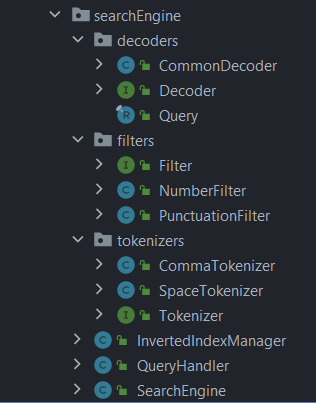
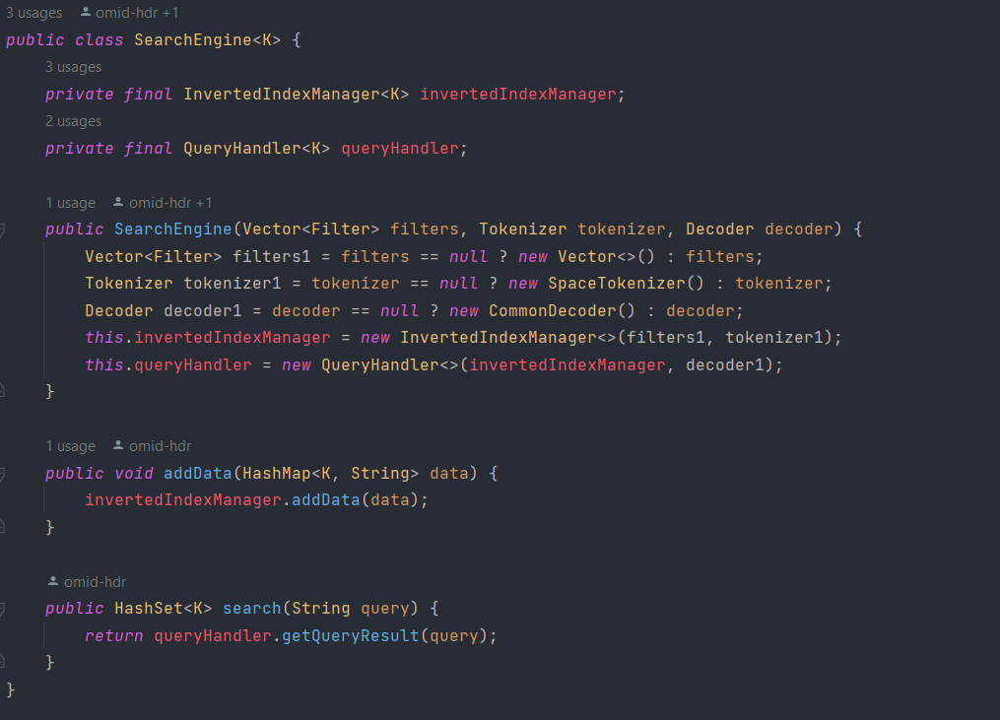
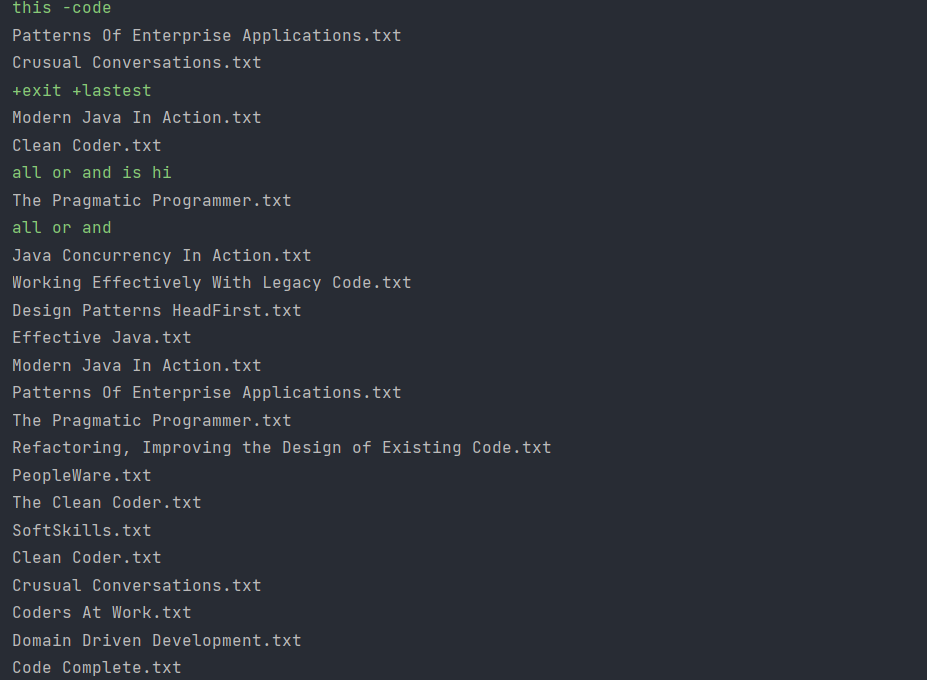

# SE_Onboard_Summer1403

# InvertedIndex SearchEngine
in this project we create a library that can search text very fast.
it has three parts
constructor and search and addData.
this is very general that you can search widely and can customize search and text .

## Tools
- Java
- Regex

## Implementation Details

## How to Run

you can import search_engine library and use this to search in texts. at first, you should create a SearchEngine Object with call its constructor.
parameters are normalizers and decoder and tokenizer.
normalizer is for filtering text. it is an interface that normalizers data. it has default normalizer that normalizer
numbers or
tokenizer is for split words, it can be by space or , etc... . it is an interface that if you want to customize you should create this class and implement it interface 
decoder is for handle input query
some words must be in text(compulsory), some words can be in text (optional) and some words shouldn't in text(forbidden).

now we should add our data with addDate function. this parameter is a hashmap<K, String>.
you can add data every time you want.

also you can use search method for searching text.

## Results

in this picture you can see it how works.
at first, we create an object of this class and pass default parameter.
then feed this with some doc about clean code.
after that search some input for example in first input we want docs that contain "this" but don't have "code" and ome doc have this requirement.
and another tests are visible.

## Related Links
 - https://www.geeksforgeeks.org/inverted-index
 - https://www.dideo.ir/v/yt/CeGtqouT8eA/how-google-searches-one-document-among-billions-of-documents-quickly%3F

## Authors
- [Omid](https://github.com/omid-hdr)
- [Ali](https://github.com/Ali-Sadeghi-Gh)

## Date
summer 2024
